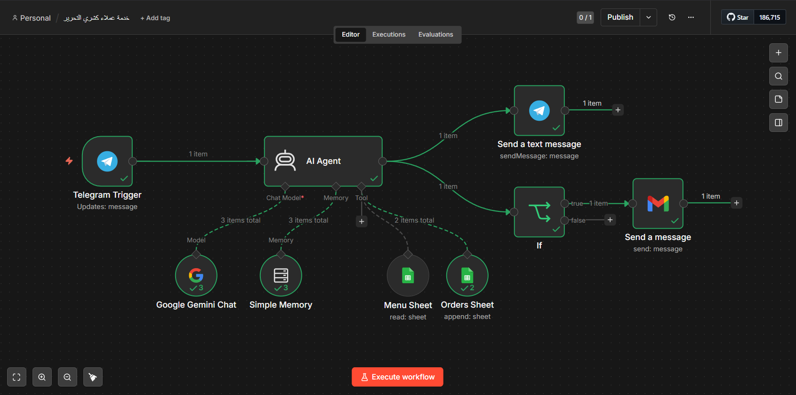
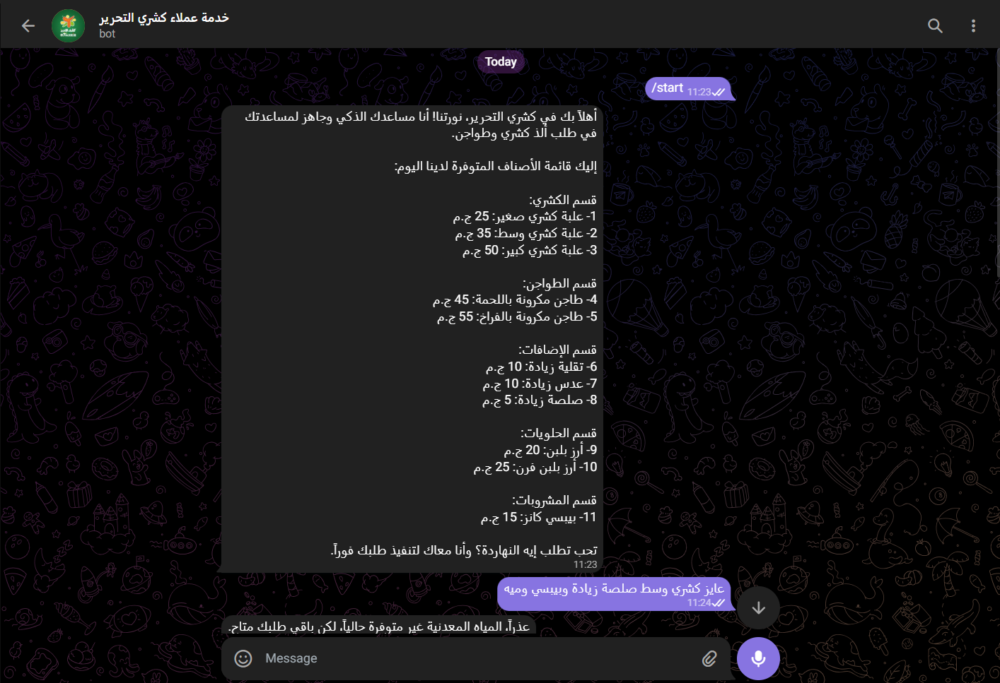
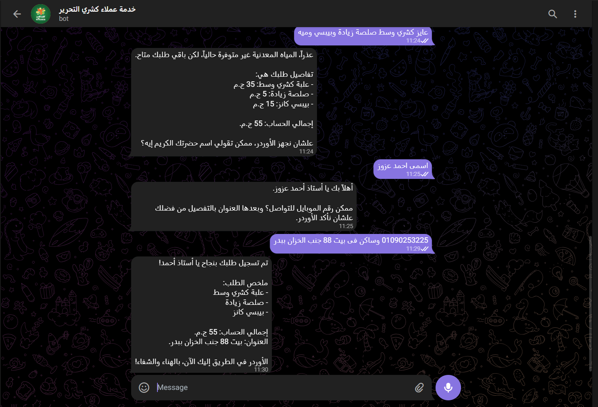
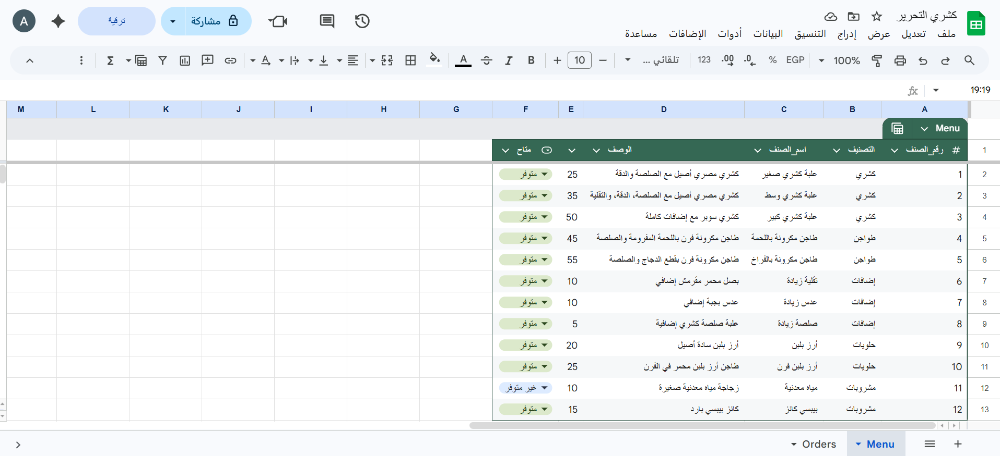
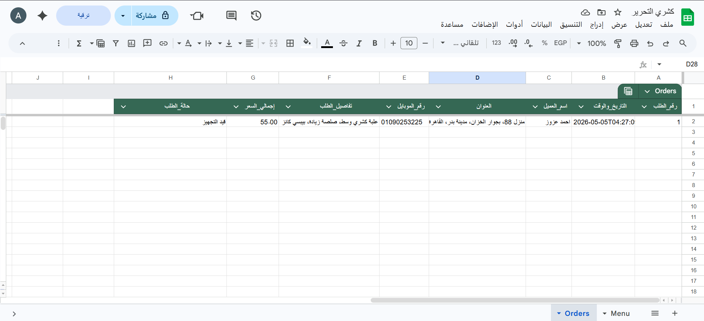
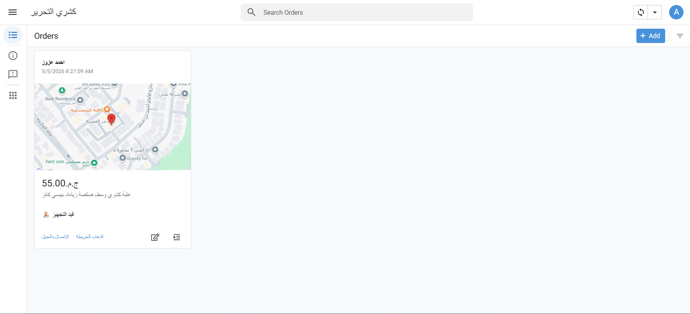
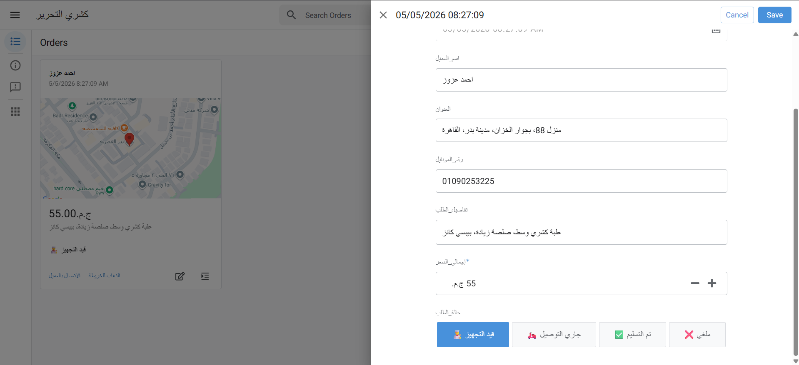
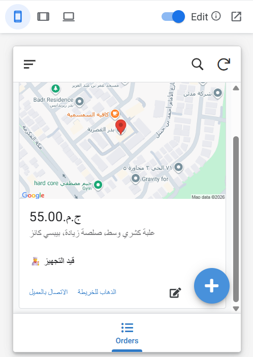

# 🚀 AI-Powered Order Management & Customer Service System (End-to-End)

## 📌 Project Overview
An end-to-end automated system designed to revolutionize restaurant operations, using "Koshary El Tahrir" as a practical case study. This project replaces manual customer service with an intelligent AI agent and provides a live operational dashboard for kitchen and delivery teams.

**Note:** The raw n8n JSON workflow file is not included in this repository to protect proprietary automation logic and API credentials. This repository serves as a technical case study.

---

## 🧠 System Architecture & Workflow
The core of the system is orchestrated using an **n8n workflow**. 
* **Input:** The process begins with a Telegram Trigger that listens for incoming messages.
* **AI Processing:** An AI Agent, powered by the Google Gemini Chat model, handles the conversation. It utilizes a "Simple Memory" node to maintain the context of the chat.
* **Database Integration:** The AI Agent is equipped with tools to read from a "Menu Sheet" and append data to an "Orders Sheet".
* **Output:** The system sends a formatted text message back to the customer via Telegram, and if conditions are met, it triggers an email notification.

## 💬 1. The Customer Experience (AI Chatbot)
The AI assistant interacts with the customer naturally via Telegram:
* **Dynamic Menu Display:** The bot greets the user and displays the categorized menu (Koshary, Tagins, Add-ons, Desserts, and Drinks) with precise pricing.
* **Smart Inventory Checking:** If a customer requests an item that is out of stock (e.g., mineral water), the bot apologizes and confirms the rest of the available order.
* **Data Collection:** The bot systematically collects the customer's name, phone number, and detailed delivery address.
* **Order Confirmation:** It provides a final summary of the items (e.g., Koshary box, extra sauce, Pepsi), the total price (e.g., 55 EGP), and confirms the delivery address.

## 📱 2. Live Operations Dashboard (Kitchen & Delivery)
Once the AI confirms the order, it instantly reflects on a custom-built management application accessible via web and mobile:
* **Multi-Device Support:** The dashboard features a Web view and a Mobile view for on-the-go access.
* **Location & Details:** Each order card displays a live map of the customer's location, the total price (e.g., 55.00 EGP), and the specific order details.
* **Quick Actions:** Delivery drivers can use dedicated buttons to "Go to Map" (الذهاب للخريطة) or "Call Customer" (الاتصال بالعميل) directly from the interface.
* **Status Tracking:** Staff can open a detailed view showing the exact order timestamp (e.g., 5/5/2026 8:27:09 AM) and customer details. They can easily update the workflow status using interactive buttons: Preparing (قيد التجهيز), Out for Delivery (جاري التوصيل), Delivered (تم التسليم), or Canceled (ملغي).

---

## 🛠️ Tech Stack
* **Workflow Automation:** n8n
* **AI Language Model:** Google Gemini
* **User Interface:** Telegram API
* **Database & Dashboard:** Google Workspace (Sheets / AppSheet)

---

### 📸 Visual Documentation

#### System Architecture (n8n Workflow)

#### AI Chatbot Interaction

#### System Database

#### Operations Dashboard (Web & Mobile)

---

## 📞 Contact

For questions or support, please reach out to:

📧 Email: [ahmedazouz.contact@gmail.com](mailto:ahmedazouz.contact@gmail.com)
🐙 GitHub: [ahm7daz0uz](https://github.com/ahm7daz0uz)
💼 LinkedIn: [Ahmed Azouz](www.linkedin.com/in/ahm7daz0uz)

---
